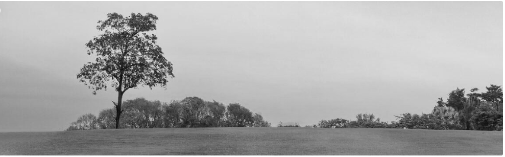

# Image Filter Studio

Image Filter Studio is a console based C++ application that allows users to load images and apply a range of filters to them. The project includes separate roles for administrators and customers, each with their own login system, along with a set of image processing filters implemented from scratch.

## Features

* Admin and Customer login system with separate menus
* Customer registration and account management
* Image loading and saving using the stb_image library
* Multiple image filters, including:
  * Grayscale
  * Invert
  * Brightness adjustment
  * Contrast adjustment
  * Box Blur
  * Flip Horizontal
  * Flip Vertical
  * Red Channel
  * Green Channel
  * Blue Channel
* File management for storing customer and session data
* Modular design with a base Filter class and individual filter implementations

## Project Structure

```
ImageFilterStudio/
    Admin.cpp / Admin.h
    Customer.cpp / Customer.h
    User.cpp / User.h
    FileManager.cpp / FileManager.h
    FilterSession.cpp / FilterSession.h
    Image.cpp / Image.h
    Pixel.cpp / Pixel.h
    Filter.h
    BoxBlurFilter.cpp / BoxBlurFilter.h
    BrightnessFilter.cpp / BrightnessFilter.h
    ContrastFilter.cpp / ContrastFilter.h
    GrayscaleFilter.cpp / GrayscaleFilter.h
    InvertFilter.cpp / InvertFilter.h
    FlipHorizontalFilter.cpp / FlipHorizontalFilter.h
    FlipVerticalFilter.cpp / FlipVerticalFilter.h
    RedChannelFilter.cpp / RedChannelFilter.h
    GreenChannelFilter.cpp / GreenChannelFilter.h
    BlueChannelFilter.cpp / BlueChannelFilter.h
    stb_image.h
    stb_image_write.h
    main.cpp
```

## Requirements

* A C++ compiler that supports C++17 or later (for example, g++)
* Ubuntu, Linux, or any environment with a standard C++ build toolchain

## Building the Project

Clone the repository and navigate into the project folder:

```
git clone https://github.com/swerabuttar-lgtm/Image-Filter-Studio.git
cd Image-Filter-Studio
```

Compile all source files using g++:

```
g++ -std=c++17 *.cpp -o ImageFilterStudio
```

## Running the Application

After building, run the executable:

```
./ImageFilterStudio
```

You will be presented with a menu offering the following options:

1. Admin Login
2. Customer Login
3. Customer Registration
4. Exit

Admins can manage the system through the admin menu, while customers can register, log in, load images, and apply filters through their own dedicated menu.

## Sample Output

Below are sample results produced by the application after applying filters to an input image.

Original Image


Filtered Output



## Notes on Data Files

The files customers.txt and sessions.txt are generated automatically at runtime to store customer and session information. These files are excluded from version control since they contain data specific to each local run of the application.

## License

This project is provided for educational purposes. You are free to use, modify, and extend it as needed.
